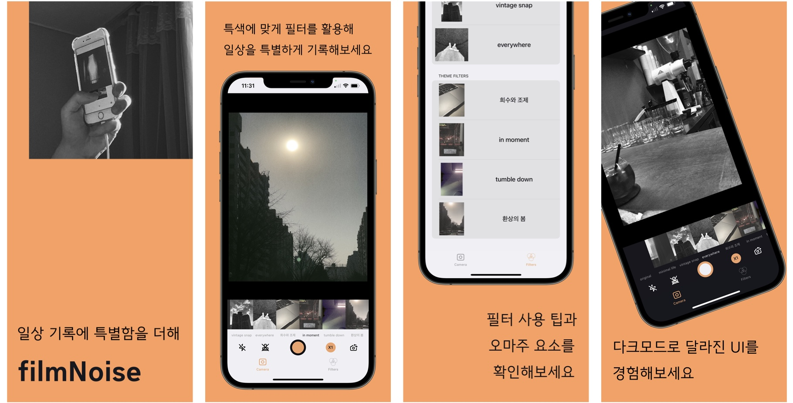

# filmNoise

#### 일상에서 누구나 감성을 더할 수 있는 사진 필터 앱입니다.

# Link

[filmNoise 앱스토어 링크](https://apps.apple.com/app/filmnoise/id6445938664)

[첫 배포 이후 블로그 회고 링크](https://velog.io/@simonyain/series/filmNoise-개발-과정)

# 개발 기간 및 인원
- 2023.02.05 ~ 2023.03.08
- 배포 이후 지속적 업데이트 중 (현재 version 2.3.1)
- 최소 버전: iOS 14.1
- 1인 개발

# 사용 기술
- **UIKit, AVFoundation, MetalKit, Photos, AppTrackingTransparency, SPM**
- **FirebaseAnalyticsWithoutAdidSupport, FirebaseCrashlytics, GoogleMobileAds, NVActivityIndicatorView**
- **MVC, Storyboard, Delegate, GCD**
- **AVCaptureSession & MTKView, custom CIFilter & CIKernel, PHPhotoLibrary**

------

# 기능 구현
- 
- 

------

# Trouble Shooting

------

# 회고
