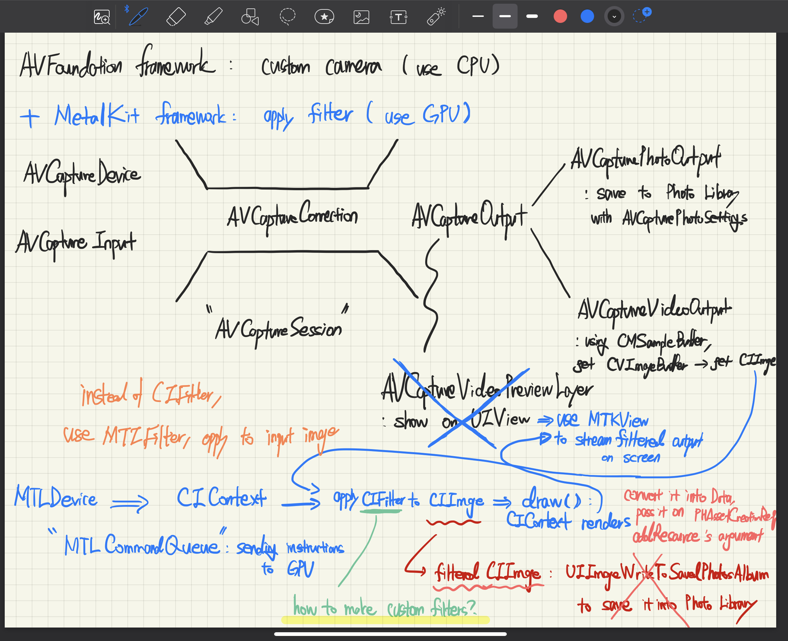
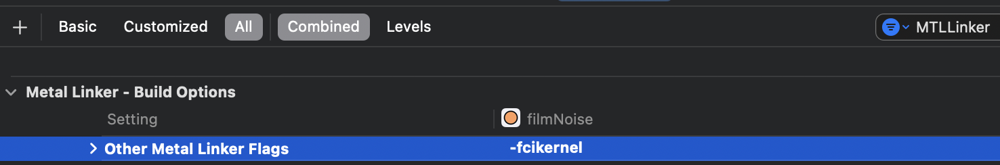

# filmNoise


#### 일상에서 누구나 감성을 더할 수 있는 사진 필터 앱입니다.

# Link

[filmNoise 앱스토어 링크](https://apps.apple.com/app/filmnoise/id6445938664)

[첫 배포 이후 블로그 회고 링크](https://velog.io/@simonyain/series/filmNoise-개발-과정)

# 개발 기간 및 인원
- 2023.02.05 ~ 2023.03.08
- 배포 이후 지속적 업데이트 중 (현재 version 2.3.1)
- 최소 버전: iOS 14.1
- 1인 개발

# 사용 기술
- **UIKit, AVFoundation, MetalKit, Photos, AppTrackingTransparency, SPM**
- **FirebaseAnalyticsWithoutAdidSupport, FirebaseCrashlytics, GoogleMobileAds, NVActivityIndicatorView**
- **MVC, Storyboard, Delegate, GCD**
- **AVCaptureSession & MTKView, custom CIFilter & CIKernel, PHPhotoLibrary**

------

# 기능 구현
- `Metal` 파일 및 커스텀 `CIFilter` 활용하여 필터 제작
  - `CIKernel` 커스텀하게 등록 후, Metal 파일 내 설정값 적용하여 CIImage 반환
- `AVCaptureSession`의 output을 `CIImage`화, `MTKView`에 실시간으로 필터 적용 화면 그려내기
  - `AVCaptureVideoDataOutputSampleBufferDelegate`의 `captureOutput` 메서드 활용, `CMSampleBuffer`에서 CIImage 추출
  - 추출한 CIImage를 `MTKViewDelegate`의 `draw` 메서드에 적용, MTKView에 `render`
- `DateFormatter`와 custom Font 활용해 촬영 날짜 그려내기
- `utsname`과 `machine` property를 활용하여 디바이스 모델명 구분, `AVCaptureDevice`의 각 모델에 맞는 듀얼/트리플 렌즈시스템 및 플래시 유무 여부 UI 구성
- AVCaptureDevice의 `authorizationStatus`, `cameraPosition`, `flashMode`, `focusMode` property 활용하여 카메라 권한 요청, 셀피, 플래시, 오토포커스 기능 구현
- `PHPhotoLibrary` 활용, 사진 저장 권한 요청 및 갤러리 앨범에 사진 저장
- `AnalyticsWithoutAdidSupport`와 `Crashlytics`를 활용, UUID 정보 없이도 UI component 활용 통계 및 크래시 정보 수집
- `ATTrackingManager` 활용하여 광고 권한 얻고 `Admob` 활용해 배너 광고 게재

### 전체 촬영 Flow


------

# Trouble Shooting

### A. CIImage 적용된 데이터를 실시간 스크린으로 보여주기 위해선 AVCaptureVideoPreviewLayer를 활용할 수 없음

실시간 Preview 화면으로 `AVCaptureVideoPreviewLayer`를 `UIView`의 layer로 설정할 수 있지만, 추가 데이터를 적용할 수 없는 특징이 존재한다.
UIView 대신 MTKView를 활용하면 매 frame을 렌더링하여 화면에 그려내기 전, 필터 데이터를 적용할 수 있다. MTKView는 UIView를 상속하므로 Preview 화면으로의 역할도 가능하다.

MTKView에 최종 결과물을 그려내기 위해선 Metal Rendering Process를 통해 render해야 한다.

- _Metal Rendering Process 준비 과정_
```swift
@IBOutlet weak var mtkView: MTKView!

//A GPU in the MetalKit framework, represented as a MTLDevice
var metalDevice: MTLDevice!
    
//a pipeline to send instructions down to MTLDevice
var metalCommandQueue: MTLCommandQueue!
    
//core image for filter
var ciContext: CIContext!
    
//core image with filter data
var currentCIImage: CIImage?

func setUpMetal() {
    //fetch the default gpu of the device (only one on iOS devices)
    metalDevice = MTLCreateSystemDefaultDevice()
        
    //setup MTKView's MTLDevice
    mtkView.device = metalDevice
        
    //update MTKView every time there’s a new frame to display
    //explicit drawing, have to call .draw()
    mtkView.isPaused = true
    
    //command queue to send down instructions to the GPU
    metalCommandQueue = metalDevice.makeCommandQueue()
        
	//send commands to GPU
    //MTKViewDelegate for responding view's drawing events
    mtkView.delegate = self

    //sample or perform read/write operations on the textures
    mtkView.framebufferOnly = false
}

func setUpCoreImage() {
	//initialize CIContext instance using Metal device
    ciContext = CIContext(mtlDevice: metalDevice)
}
```
- _AVCaptureVideoDataOutputSampleBufferDelegate의 captureOutput 메서드에서 원본 image buffer에서 CIImage 추출, MTKViewDelegate의 draw 메서드 호출_
```swift
//filter 적용 CIImage 반환할 함수 타입 변수
//시작 시, original 적용
var selectedFilter: (CIImage) -> CIImage? = FilterFunctions.original(ciImage:)

//유저가 특정 필터를 선택할 시, 해당 필터를 담고 있을 변수
var currentCIImage: CIImage?

extension ViewController: AVCaptureVideoDataOutputSampleBufferDelegate {
	func captureOutput(_ output: AVCaptureOutput, didOutput sampleBuffer: CMSampleBuffer, from connection: AVCaptureConnection) {		

		//get CVImageBuffer out of the sample buffer
		guard let cvBuffer = CMSampleBufferGetImageBuffer(sampleBuffer) else {
			debugPrint("unable to get image from sampleBuffer")
			return
		}
		
		//get CIImage out of the CVImageBuffer
		let ciImage = CIImage(cvImageBuffer: cvBuffer)

		//필터 적용
		guard let resultImage = selectedFilter(ciImage) else { return }

		//save it in variable to draw in mtkView
		self.currentCIImage = resultImage

		//draw on MTKView
		mtkView.draw()
	}
}
```

- _MTKViewDelegate의 draw 메서드 수행_
```swift
extension ViewController: MTKViewDelegate {
	//render on screen
	func draw(in view: MTKView) {
    	//store a reference to each frame
    	guard let commandBuffer = metalCommandQueue.makeCommandBuffer() else { return }
        
	    //ciImage with filter data to work with
    	guard let ciImage = currentCIImage else { return }

		//make sure currentDrawable object is available
    	//should not be in use by previous draw cycle
    	guard let currentDrawable = view.currentDrawable else { return }

    	let widthOfDrawable = view.drawableSize.width
    	let heightOfDrawable = view.drawableSize.height
        
    	//frame is centered on screen
    	let widthOfciImage = ciImage.extent.width
    	let xOffsetFromBottom = (widthOfDrawable - widthOfciImage)/2
        
    	let heightOfciImage = ciImage.extent.height
    	let yOffsetFromBottom = (heightOfDrawable - heightOfciImage)/2
            
    	//render a CIImage into our metal texture
        
    	//image: CIImage for each frame
    	//texture: rendering it to the screen through mtkView
    	//commandBuffer: instructions sent through commandQueue to GPU
    	//bounds: GCRect to draw the image on the texture
    	//colorSpace: tells CIContext how to interpret color info from CIImage
    	self.ciContext.render(ciImage, to: currentDrawable.texture, commandBuffer: commandBuffer, bounds: CGRect(origin: CGPoint(x: -xOffsetFromBottom, y: -yOffsetFromBottom), size: view.drawableSize), colorSpace: CGColorSpaceCreateDeviceRGB())
        
    	//register to draw the instructions in the command buffer once it executes
    	commandBuffer.present(currentDrawable)
        
    	//commit the command to the queue ~ execute
    	commandBuffer.commit()
	}
}
```

-----

### B. Custom CIFilter 제작

기본 제공되는 CIFilter만 활용하기엔 수치 조정을 직접 할 수 없어서 원하는 색감 표현에 한계가 존재했다. Metal로 직접 CIFilter를 만들어 활용했다.

#### 1. WWDC의 Session을 참고하며 Xcode Build Settings에서 Metal Linker - Build Options에 `-fcikernel`을 추가해서 CIKernel 인식을 할 수 있도록 해준다.



#### 2. 이미지 프로세싱을 위한 도메인 지식을 활용해 Metal 파일에서 수치를 조정했다.

예를 들어 대비(Contrast) 보정 알고리즘은 다음과 같다.

> Contrast = Luminance difference / Average Luminance

각 픽셀의 RGB값은 8bit의 0~255 사이의 값을 가지므로 average luminance는 중간값인 128이다.
중간값과 차가 많이 날 수록 그 차이를 줄여줄여면 중간값으로 나눠 전체 밝기 차이를 줄여준다.
중간값에서 각 픽셀의 값 사이의 차이를 Luminance difference로 설정하면 다음과 같이 작성할 수 있다. 
(F: 보정계수)

$$RGB' = F(RGB-128) + 128$$

Metal에서 sample 영역의 RGB 값은 0부터 1의 부동소수점이므로, 대비 보정을 위한 코드를 작성하면 다음과 같다.

```metal
//contrast: 원하는 대비 수준, 보정 계수
sample.rgb = (sample.rgb - 0.5) * contrast + 0.5;
```

이를 토대로 작성한 필터 코드들은 다음과 같다.

##### minimal life: 흑백 필터로 정석 grayscale 수치를 활용한다.

```metal
#include <metal_stdlib>
using namespace metal;

#include <CoreImage/CoreImage.h>

extern "C" {
    namespace coreimage {
        float4 AgfaAPX400 (sample_t s,
                           float gammaCorrection,
                           float exposure,
                           float contrast)
        {

            // exposure adjustment
            if (s.r + exposure > 1) {
                s.r = 1;
            } else if (s.r + exposure < 0) {
                s.r = 0;
            } else {
                s.r += exposure;
            }
            
            if (s.b + exposure > 1) {
                s.b = 1;
            } else if (s.b + exposure < 0) {
                s.b = 0;
            } else {
                s.b += exposure;
            }
            
            if (s.g + exposure > 1) {
                s.g = 1;
            } else if (s.g + exposure < 0) {
                s.g = 0;
            } else {
                s.g += exposure;
            }
            
            //convert color to grayscale
            float gray = dot(s.rgb, float3(0.299, 0.587, 0.114));
            s.rgb = float3(gray);

            //adjust contrast
            s.rgb = (s.rgb - 0.5) * contrast + 0.5;

            //gamma correction
            s.rgb = pow(s.rgb, gammaCorrection);
            
            return s;
        }
    }
}
```

##### tumble down: 암부 부분에서 보라 계열 색이 올라오는 효과를 지닌다.

```metal
#include <metal_stdlib>
using namespace metal;

#include <CoreImage/CoreImage.h>

extern "C" {
    namespace coreimage {
        float4 Evangelion (sample_t s,
                           float gammaCorrection,
                           float exposure,
                           float contrast)
        {
            
            //exposure
            if (s.r + exposure > 1) {
                s.r = 1;
            } else if (s.r + exposure < 0) {
                s.r = 0;
            } else {
                s.r += exposure;
            }
            
            if (s.b + exposure > 1) {
                s.b = 1;
            } else if (s.b + exposure < 0) {
                s.b = 0;
            } else {
                s.b += exposure;
            }
            
            if (s.g + exposure > 1) {
                s.g = 1;
            } else if (s.g + exposure < 0) {
                s.g = 0;
            } else {
                s.g += exposure;
            }
            
            //contrast
            s.rgb = (s.rgb - 0.5) * contrast + 0.5;
            
            //gamma correction
            s.rgb = pow(s.rgb, gammaCorrection);
         
            //check luminance of color
            //float3(0.2126, 0.7152, 0.0722): y(luminance) of monitor
            float luma = dot(s.rgb, float3(0.2126, 0.7152, 0.0722));
            if (luma < 0.3) {
                s.rgb += float3(0.0077, 0.00268, 0.03215);
            }
        
            return s;
        }
    }
}
```

dot 함수는 벡터값 처리 함수로 행렬의 각 element를 서로 곱한 값들의 합을 결과물을 얻는다.

> A = [a1, a2, a3], B = [b1, b2, b3]

> dot(A, B) = (a1 * b1) + (a2 * b2) + (a3 * b3)

각 픽셀은 R, G, B값이 존재하므로 각 픽셀에 grayscale 적용값을 설정해 색상 정보를 죽이고 밝기만을 다루는 효과를 가진다.


#### 3. swift 파일로 metal 파일을 등록해서 CIImage를 반환값으로 받는다.

```swift
class AgfaAPX400Filter: CIFilter {
    
    var gammaCorrection: Float = 2.0
    var exposure: Float = 0.03
    var contrast: Float = 0.75
    
    private let kernel: CIKernel
    
    override init() {
        //kernel setting: metallib에 등록된 kernel 불러오며 커스텀 CIFilter 초기화
        let url = Bundle.main.url(forResource: "default", withExtension: "metallib")!
        let data = try! Data(contentsOf: url)
        self.kernel = try! CIColorKernel(functionName: "AgfaAPX400", fromMetalLibraryData: data)
        super.init()
    }
    
    required init?(coder aDecoder: NSCoder) {
        fatalError("init(coder:) has not been implemented")
    }

	//CIImage 산출
    func outputImage(input: CIImage) -> CIImage? {
        //extent: area for applying kernel
        //roi: region of interest for sampling (specify which region of input should be processed)
        return self.kernel.apply(extent: input.extent, roiCallback:  { _, r in r }, arguments: [input, gammaCorrection, exposure, contrast])
    }
}
```

#### 4. 커스텀 필터 적용한 CIImage에 기존 CIFilter chaining으로 조합하여 원하는 최종 CIImage 반환

```swift
struct FilterFunctions {
	private struct VectorSetting {
        let grayscaleVector = CIVector(x: 0.2126, y: 0.7152, z: 0.0722, w: 0)
        let AlphaVector = CIVector(x: 0, y: 0, z: 0, w: 1)
        let zeroVector = CIVector(x: 0, y: 0, z: 0, w: 0)
    }
    
    private struct NoiseSetting {
        // Adjust noise image using CIColorControls
        let noiseBrightness: Float
        let noiseContrast: Float
        let noiseSaturation: Float
        
        init(brightness noiseBrightness: Float, contrast noiseContrast: Float, saturation noiseSaturation: Float) {
            self.noiseBrightness = noiseBrightness
            self.noiseContrast = noiseContrast
            self.noiseSaturation = noiseSaturation
        }
    }

	//필터 적용하지 않은 default CIImage
	static func original(ciImage image: CIImage) -> CIImage? {
        return image
    }

	//minimal life
    static func agfaAPX400(ciImage image: CIImage) -> CIImage? {
        let agfaFilter = AgfaAPX400Filter()
        let agfaResult = agfaFilter.outputImage(input: image)
        
        let vectorSetting = VectorSetting()
        //create B&W image of original for masking's background
        guard
            let grayscaleFilter = CIFilter(name: "CIColorMatrix", parameters:
                                           [
                                            kCIInputImageKey: image,
                                            "inputRVector": vectorSetting.grayscaleVector,
                                            "inputGVector": vectorSetting.grayscaleVector,
                                            "inputBVector": vectorSetting.grayscaleVector,
                                            "inputAVector": vectorSetting.AlphaVector,
                                            "inputBiasVector": vectorSetting.zeroVector
                                           ]),
            let bwImage = grayscaleFilter.outputImage
        else {
            print("Can't produce grayscaleFilter and bwImage")
            return nil
        }
        
        //create randomly varying speckle
        guard
            let colorNoise = CIFilter(name: "CIRandomGenerator"),
            let noiseImage = colorNoise.outputImage
        else {
            print("Can't produce grainImage")
            return nil
        }
        
        let noiseSettingForAgfa = NoiseSetting(brightness: 0.6, contrast: 0.9, saturation: 1.8)
        guard
            let noiseControlsFilter = CIFilter(name: "CIColorControls", parameters:
                                                [
                                                    kCIInputImageKey: noiseImage,
                                                    kCIInputBrightnessKey: noiseSettingForAgfa.noiseBrightness,
                                                    kCIInputContrastKey: noiseSettingForAgfa.noiseContrast,
                                                    kCIInputSaturationKey: noiseSettingForAgfa.noiseSaturation
                                                ]),
            let adjustedNoiseImage = noiseControlsFilter.outputImage
        else {
            print("Can't produce noiseControlsFilter and adjustedNoiseImage")
            return nil
        }
        
        //blend agfaResult, bw original image with mask of noiseFilter
        guard
            let blendFilter = CIFilter(name: "CIBlendWithMask", parameters:
                                        [
                                            kCIInputImageKey: agfaResult!,
                                            kCIInputBackgroundImageKey: bwImage,
                                            kCIInputMaskImageKey: adjustedNoiseImage
                                        ]),
            let blendImage = blendFilter.outputImage
        else {
            print("Can't produce blendFilter and blendImage")
            return nil
        }

		//mask 적용하면서 노이즈로 테두리 설정되는 것 방지
        return blendImage.cropped(to: image.extent)
    }

	//tumble down
	static func evangelion(ciImage image: CIImage) -> CIImage? {
        let evaFilter = EvangelionFilter()
        let evaResult = evaFilter.outputImage(input: image)
        
        let vectorSetting = VectorSetting()
        guard
            let grayscaleFilter = CIFilter(name: "CIColorMatrix", parameters:
                                           [
                                            kCIInputImageKey: image,
                                            "inputRVector": vectorSetting.grayscaleVector,
                                            "inputGVector": vectorSetting.grayscaleVector,
                                            "inputBVector": vectorSetting.grayscaleVector,
                                            "inputAVector": vectorSetting.AlphaVector,
                                            "inputBiasVector": vectorSetting.zeroVector
                                           ]),
            let bwImage = grayscaleFilter.outputImage
        else {
            print("Can't produce grayscaleFilter and bwImage")
            return nil
        }
        
        guard
            let colorNoise = CIFilter(name: "CIRandomGenerator"),
            let noiseImage = colorNoise.outputImage
        else {
            print("Can't produce grainImage")
            return nil
        }
        
        let noiseSettingForEva = NoiseSetting(brightness: 0.65, contrast: 1.13, saturation: 1.27)
        guard
            let noiseControlsFilter = CIFilter(name: "CIColorControls", parameters:
                                                [
                                                    kCIInputImageKey: noiseImage,
                                                    kCIInputBrightnessKey: noiseSettingForEva.noiseBrightness,
                                                    kCIInputContrastKey: noiseSettingForEva.noiseContrast,
                                                    kCIInputSaturationKey: noiseSettingForEva.noiseSaturation
                                                ]),
            let adjustedNoiseImage = noiseControlsFilter.outputImage
        else {
            print("Can't produce noiseControlsFilter and adjustedNoiseImage")
            return nil
        }
        
        guard
            let blendFilter = CIFilter(name: "CIBlendWithMask", parameters:
                                        [
                                            kCIInputImageKey: evaResult!,
                                            kCIInputBackgroundImageKey: bwImage,
                                            kCIInputMaskImageKey: adjustedNoiseImage
                                        ]),
            let blendImage = blendFilter.outputImage
        else {
            print("Can't produce blendFilter and blendImage")
            return nil
        }
        
        return blendImage.cropped(to: image.extent)
    }
}
```

#### 5. 유저가 해당 필터 선택 시, 함수 타입의 변수에 할당, AVCaptureVideoDataOutputSampleBufferDelegate의 captureOutput에 활용

```swift
func collectionView(_ collectionView: UICollectionView, didSelectItemAt indexPath: IndexPath) {
        let nameLabel = filterManager.getWholeFilterData()[indexPath.row].nameLabel
        
        switch nameLabel {
        case "minimal life":
            selectedFilter = FilterFunctions.agfaAPX400(ciImage:)
        case "tumble down":
            selectedFilter = FilterFunctions.evangelion(ciImage:)
        default:
            selectedFilter = FilterFunctions.original(ciImage:)
        }
        self.selectedFilterLabel = nameLabel
}
```

------

### C. 필터 데이터 적용된 이미지로 저장하기

1. `AVCapturePhotoOutput`을 활용, `captureOutput` 메서드에서의 한 프레임을 저장 시, `photoOutput` 메서드는 원본 프레임의 데이터만 매개변수로 받고 있다.

```swift
extension CameraViewController: AVCapturePhotoCaptureDelegate {
	func photoOutput(_ output: AVCapturePhotoOutput, didFinishProcessingPhoto photo: AVCapturePhoto, error: Error?) {
		PHPhotoLibrary.shared().performChanges({
			// Add the captured photo's file data as the main resource for the Photos asset.
			let creationRequest = PHAssetCreationRequest.forAsset()
			creationRequest.addResource(with: .photo, data: photo.fileDataRepresentation()!, options: nil)
		})
	}
}
```

2. 필터 적용된 CIImage를 `UIImageSavedToPhotosAlbum` 메서드로 저장 시, 이미지 사이즈가 300kb 미만의 저화질 사진이 되는 문제가 있었다. (photoOutput: 10~20mb 크기)

따라서 필터 데이터 CIImage를 Data type으로 변환하여 photoOutput에서 해당 data를 저장하도록 해결을 했다.

```swift
extension ViewController: AVCapturePhotoCaptureDelegate {
	func photoOutput(_ output: AVCapturePhotoOutput, didFinishProcessingPhoto photo: AVCapturePhoto, error: Error?) {
		//get CIImage from captureOutput, which has filter data
		guard let ciImage = currentCIImage else { return }
    
        let filteredImage = UIImage(ciImage: ciImage)
		//크기 조절 및 data로 변환
		let data = filteredImage.jpegData(compressionQuality: 0.98)

		PHPhotoLibrary.shared().performChanges({
			PHAssetCreationRequest.forAsset().addResource(with: .photo, data: self.data!, options: nil)
		})
	}
}
```

------

### D. AVCaptureSession input 충돌 문제

`AVCaptureSession`에서 input은 한 프레임에 하나만 가능하다. 따라서 새로운 device type이나 전면 카메라로 변경 시, input 조정이 없다면 여러 input을 넣게되는 문제가 발생한다.
따라서 전면/후면 카메라 전환과 후면 듀얼/트리플 렌즈에서 전환 시, session의 configuration을 변경하도록 작성했다.

_전면/후면 카메라 전환_

```swift
@IBAction func switchCameraButtonTapped(_ sender: UIButton) {
	//reconfigure input
	captureSession.beginConfiguration()
        
	//후면카메라에서 누른 경우: 전면카메라로 전환하기
	if cameraPosition != .front {
		captureSession.removeInput(backInput)
		captureSession.addInput(frontInput)

		//mirror video if front camera
		videoOutput.connections.first?.isVideoMirrored = true
		photoOutput.connections.first?.isVideoMirrored = true
            
		cameraPosition = .front

		//전면카메라 전환 시 후면 렌즈 선택 숨기기
		cameraLensButton.setValue(true, forKey: "hidden")
	} else {
		//전면카메라에서 누른 경우: 후면카메라로 전환하기
		captureSession.removeInput(frontInput)
	    captureSession.addInput(backInput)
            
        videoOutput.connections.first?.isVideoMirrored = false
		photoOutput.connections.first?.isVideoMirrored = false
            
		cameraPosition = .back
            
		//후면카메라 전환 시 렌즈 선택 다시 보이기
		cameraLensButton.setValue(false, forKey: "hidden")
	}

	//deal with the connection again for portrait mode
	videoOutput.connections.first?.videoOrientation = .portrait
	photoOutput.connections.first?.videoOrientation = .portrait
        
	photoOutput.isHighResolutionCaptureEnabled = true

	//commit config
	captureSession.commitConfiguration()
}
```

_듀얼/트리플 카메라 전환_

```swift
@IBAction func cameraLensButtonPressed(_ sender: UIButton) {
	//reconfigure input
    captureSession.beginConfiguration()
        
	//Create a new input and add it to the session
    captureSession.removeInput(backInput)		

	guard let newBackInput = try? AVCaptureDeviceInput(device: backCamera) else {
		fatalError("could not create new input device from chainging camera lens")
    }
    backInput = newBackInput
        
    captureSession.addInput(self.backInput)		

    videoOutput.connections.first?.videoOrientation = .portrait
    photoOutput.connections.first?.videoOrientation = .portrait
        
    photoOutput.isHighResolutionCaptureEnabled = true
    
	captureSession.commitConfiguration()
}
```

-----

### E. 디바이스 별 특성 고려

아이폰 및 아이패드의 경우, 라인업 모델 티어와 발매 시점에 따라 렌즈 구성 및 플래시 유무가 다르다.

아이폰의 경우, 같은 듀얼/트리플 렌즈라고 해도 렌즈 배율도 달라진다.
모델 구분은 다음과 같다. (iPhone 15까지 라인업 고려)

|모델|초광각|광각|망원|
|------|---|---|---|
|SE, 6S, 6S Plus, XR, SE2, SE3||X1||
|7 Plus, 8 Plus, X, XS, XS Max||X1|X2|
|11, 12 mini, 12, 13 mini, 13, 14, 14 Plus, 15, 15 Plus|X0.5|X1||
|11 Pro, 11 Pro Max, 12 Pro|X0.5|X1|X2|
|12 Pro Max|X0.5|X1|X2.5|
|13 Pro, 13 Pro Max, 14 Pro, 14 Pro Max, 15 Pro|X0.5|X1|X3|
|15 Pro Max|X0.5|X1|X5|

아이패드의 경우, 아이패드 프로 라인업을 제외하면 모든 아이패드는 플래시가 존재하지 않는다. 플래시 버튼 기능을 활용하면 런타임 에러가 난다.
업데이트 심사 도중 테스트 기기인 아이패드에서 플래시가 없는 상황에서 플래시 버튼을 눌러 크래시가 난 경우로 심사 거부를 당한 경험도 있다.

이를 해결하기 위해서 각 모델의 이름을 String으로 받아 각 특징별 UI를 다르게 적용한다.

```swift
private func getModelName() -> String {
        var systemInfo = utsname()
        uname(&systemInfo)
        let machineMirror = Mirror(reflecting: systemInfo.machine)
        let model = machineMirror.children.reduce("") { identifier, element in
            guard let value = element.value as? Int8, value != 0 else { return identifier }
            return identifier + String(UnicodeScalar(UInt8(value)))
        }
        
        //dual, triple 각 모델 구분 목적
        //매년 새모델 업데이트 필요
        switch model {
        case "iPhone9,2", "iPhone9,4":                  return "iPhone 7 Plus"
        case "iPhone10,2", "iPhone10,5":                return "iPhone 8 Plus"
        case "iPhone10,3", "iPhone10,6":                return "iPhone X"
        case "iPhone11,2":                              return "iPhone XS"
        case "iPhone11,4", "iPhone11,6":                return "iPhone XS Max"
        case "iPhone12,1":                              return "iPhone 11"
        case "iPhone12,3":                              return "iPhone 11 Pro"
        case "iPhone12,5":                              return "iPhone 11 Pro Max"
        case "iPhone13,1":                              return "iPhone 12 Mini"
        case "iPhone13,2":                              return "iPhone 12"
        case "iPhone13,3":                              return "iPhone 12 Pro"
        case "iPhone13,4":                              return "iPhone 12 Pro Max"
        case "iPhone14,4":                              return "iPhone 13 mini"
        case "iPhone14,5":                              return "iPhone 13"
        case "iPhone14,2":                              return "iPhone 13 Pro"
        case "iPhone14,3":                              return "iPhone 13 Pro Max"
        case "iPhone14,7":                              return "iPhone 14"
        case "iPhone14,8":                              return "iPhone 14 Plus"
        case "iPhone15,2":                              return "iPhone 14 Pro"
        case "iPhone15,3":                              return "iPhone 14 Pro Max"
        case "iPhone15,4":                              return "iPhone 15"
        case "iPhone15,5":                              return "iPhone 15 Plus"
        case "iPhone16,1":                              return "iPhone 15 Pro"
        case "iPhone16,2":                              return "iPhone 15 Pro Max"
            
        //iPad for non-flash model
        case "iPad6,11", "iPad6,12":                    return "iPad 5"
        case "iPad7,5", "iPad7,6":                      return "iPad 6"
        case "iPad7,11", "iPad7,12":                    return "iPad 7"
        case "iPad11,6", "iPad11,7":                    return "iPad 8"
        case "iPad12,1", "iPad12,2":                    return "iPad 9"
        case "iPad13,18", "iPad13,19":                  return "iPad 10"
        case "iPad5,3", "iPad5,4":                      return "iPad Air 2"
        case "iPad11,3", "iPad11,4":                    return "iPad Air 3"
        case "iPad13,1", "iPad13,2":                    return "iPad Air 4"
        case "iPad13,16", "iPad13,17":                  return "iPad Air 5"
        case "iPad5,1", "iPad5,2":                      return "iPad Mini 4"
        case "iPad11,1", "iPad11,2":                    return "iPad Mini 5"
        case "iPad14,1", "iPad14,2":                    return "iPad Mini 6"
        case "iPad6,7", "iPad6,8":                      return "iPad Pro 12.9-inch"
        default:                                        return model
        } 
    }
```

프로 모델의 트리플 카메라 경우, 망원 배율을 각 모델에 맞게 다르게 설정한다.

```swift
if backCamera == AVCaptureDevice.default(.builtInWideAngleCamera, for: .video, position: .back) {
	backCamera = AVCaptureDevice.default(.builtInTelephotoCamera, for: .video, position: .back)
	isZoomIn = true
            
	DispatchQueue.main.async {
		switch self.modelName {
		case "iPhone 12 Pro Max":
            self.cameraLensButton.setImage(UIImage(named: "telephotoAngle2.5"), for: .normal)
		case "iPhone 11 Pro", "iPhone 11 Pro Max", "iPhone 12 Pro":
			self.cameraLensButton.setImage(UIImage(named: "telephotoAngle2"), for: .normal)
		case "iPhone 15 Pro Max":
			self.cameraLensButton.setImage(UIImage(named: "telephotoAngle5"), for: .normal)
		default:
			self.cameraLensButton.setImage(UIImage(named: "telephotoAngle3"), for: .normal)
		}
	}
}
```

플래시 없는 아이패드 모델의 경우, 플래시 버튼을 숨기도록 한다.

```swift
let nonFlashIpadModels = ["iPad 5", "iPad 6", "iPad 7", "iPad 8", "iPad 9", "iPad 10", "iPad Air 2", "iPad Air 3", "iPad Air 4", "iPad Air 5", "iPad Mini 4", "iPad Mini 5", "iPad Mini 6", "iPad Pro 12.9-inch"]

if nonFlashIpadModels.contains(modelName!) {
	flashButton.setValue(true, forKey: "hidden")
} else {
	flashButton.setImage(UIImage(named: "flashOff"), for: .normal)
    flashButton.contentMode = .scaleAspectFill
}
```

------

# 회고

- 필터 적용해서 Data 저장 시, 아쉬운 점은 원본 프레임에 담긴 metadata를 날리게 된다는 것이었다. `CMSampleBuffer`에서 metadata까지 얻어와서 같이 저장하도록 설정하는 작업이 필요했지만 당시에는 여기까지 구현할 여력이 없었던 것으로 보인다. 

- photoOutput에서 저장 시, 갤러리에만 저장하고 있지만 보통 필터나 카메라 앱 서비스들은 해당 앱으로 찍은 사진 디렉토리를 설정해준다. 갤러리에서 사진 찾기가 어렵다는 피드백을 받아서 `PHCollectionListChangeRequest`를 활용해서 디렉토리 설정과 더불어 같이 저장을 해야겠다는 필요성을 느끼고 있다.

아쉬웠던 점들은 차후 업데이트로 지원해서 해결해나갈 예정이다.
